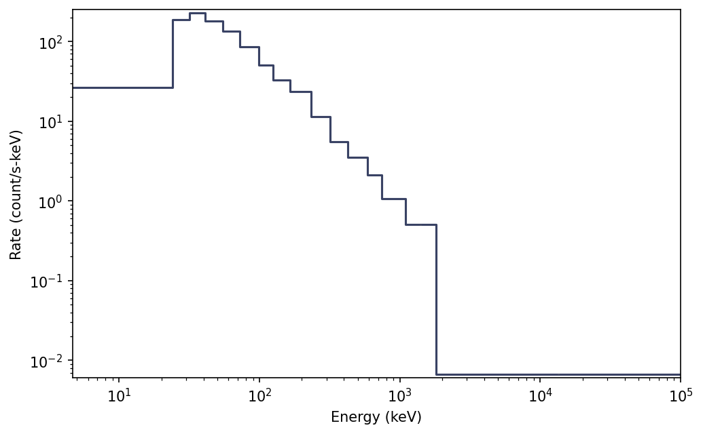

.. _batse-gallery:

Data File Gallery
=================
The galleries below show the continuous and trigger science data types that 
can be accessed with the GDT.

.. |spec_cont_t| image:: gallery_figs/spec_cont_6526_6.png
   :scale: 25%
   :align: top
.. |lc_discsc_t| image:: gallery_figs/lc_discsc_6526.png    
   :scale: 25%
   :align: middle

.. |lc_dsherb_t| image:: gallery_figs/lc_dsherb_6526_6.png    
   :scale: 25%
   :align: middle
.. |spec_dsherb_t| image:: gallery_figs/spec_dsherb_6526_6.png
   :scale: 25%
   :align: top
.. |lc_her_t| image:: gallery_figs/lc_her_6526_6.png    
   :scale: 25%
   :align: middle
.. |spec_her_t| image:: gallery_figs/spec_her_6526_6.png
   :scale: 25%
   :align: top

.. |spec_herb_t| image:: gallery_figs/spec_herb_6526_6.png
   :scale: 25%
   :align: top

.. |lc_sherb_t| image:: gallery_figs/lc_sherb_6526_6.png    
   :scale: 25%
   :align: middle
.. |spec_sherb_t| image:: gallery_figs/spec_sherb_6526_6.png
   :scale: 25%
   :align: top

.. |lc_tte_t| image:: gallery_figs/lc_tte_6526.png    
   :scale: 25%
   :align: middle
.. |spec_tte_t| image:: gallery_figs/spec_tte_6526.png
   :scale: 25%
   :align: top

Daily Data
----------

+----------------+-------------+---------------+
|    Data Type   |  Lightcurve | Count Spectrum|
+================+=============+===============+
| | **CONT**     |             |               |
| | 16 channels  |  |lc_cont|  |  |spec_cont|  |
| | 2.048 s res  |             |               |
| | 1+ detectors |             |               |
+----------------+-------------+---------------+
| | **DISCLA**   |             |               |
| | 4 channels   | |lc_discla| | |spec_discla| |
| | 1.024 s res  |             |               |
| | 1+ detectors |             |               |
+----------------+-------------+---------------+

Trigger Data
------------

+----------------------+---------------+-----------------+
|      Data Type       |   Lightcurve  | Count Spectrum  |
+======================+===============+=================+
| | **CONT**           |               |                 |
| | 16 channels        |  |lc_cont_t|  |  |spec_cont_t|  |
| | 2.048 s res        |               |                 |
| | 1 detector         |               |                 |
+----------------------+---------------+-----------------+
| | **DISCSC**         |               |                 |
| | 4 channels         | |lc_discsc_t| | |spec_discsc_t| |
| | 1.024/0.064 s res  |               |                 |
| | Summed detectors   |               |                 |
+----------------------+---------------+-----------------+
| | **DISCSP**         |               |                 |
| | 4 channels         | |lc_discsp_t| | |spec_discsp_t| |
| | 2.048 s res        |               |                 |
| | 1 detector         |               |                 |
+----------------------+---------------+-----------------+
| | **DSHERB**         |               |                 |
| | 4 channels         | |lc_dsherb_t| | |spec_dsherb_t| |
| | 2.048 s res        |               |                 |
| | 1 detector         |               |                 |
+----------------------+---------------+-----------------+
| | **HER**            |               |                 |
| | 128 channels       |  |lc_her_t|   |  |spec_her_t|   |
| | variable, >1 s res |               |                 |
| | 1 detector         |               |                 |
+----------------------+---------------+-----------------+
| | **HERB**           |               |                 |
| | 128 channels       |  |lc_herb_t|  |  |spec_herb_t|  |
| | variable, >1 s res |               |                 |
| | 1 detector         |               |                 |
+----------------------+---------------+-----------------+
| | **MER**            |               |                 |
| | 16 channels        |  |lc_mer_t|   |  |spec_mer_t|   |
| | 2.048/0.016 s res  |               |                 |
| | Summed detectors   |               |                 |
+----------------------+---------------+-----------------+
| | **SDISC**          |               |                 |
| | 4 channels         |  |lc_sdisc_t| |  |spec_sdisc_t| |
| | 2.048 s res        |               |                 |
| | 1 detector         |               |                 |
+----------------------+---------------+-----------------+
| | **SHER**           |               |                 |
| | 252 channels       |  |lc_sher_t|  |  |spec_sher_t|  |
| | variable, >1 s res |               |                 |
| | 1 detector         |               |                 |
+----------------------+---------------+-----------------+
| | **SHERB**          |               |                 |
| | 252 channels       |  |lc_sherb_t| |  |spec_sherb_t| |
| | variable, >1 s res |               |                 |
| | 1 detector         |               |                 |
+----------------------+---------------+-----------------+
| | **STTE LIST**      |               |                 |
| | 252 channels       |  |lc_stte_t|  |  |spec_stte_t|  |
| | time-tagged events |               |                 |
| | 1+ detectors       |               |                 |
+----------------------+---------------+-----------------+
| | **TTE**            |               |                 |
| | 4 channels         |  |lc_tte_t|   |  |spec_tte_t|   |
| | 1.024/0.064/0.005 s|               |                 |
| | Summed detectors   |               |                 |
+----------------------+---------------+-----------------+
| | **TTS**            |               |                 |
| | 1 channel (4 bands)|  |lc_tts_t|   |  |spec_tts_t|   |
| | variable, <1 s res |               |                 |
| | Summed detectors   |               |                 |
+----------------------+---------------+-----------------+
