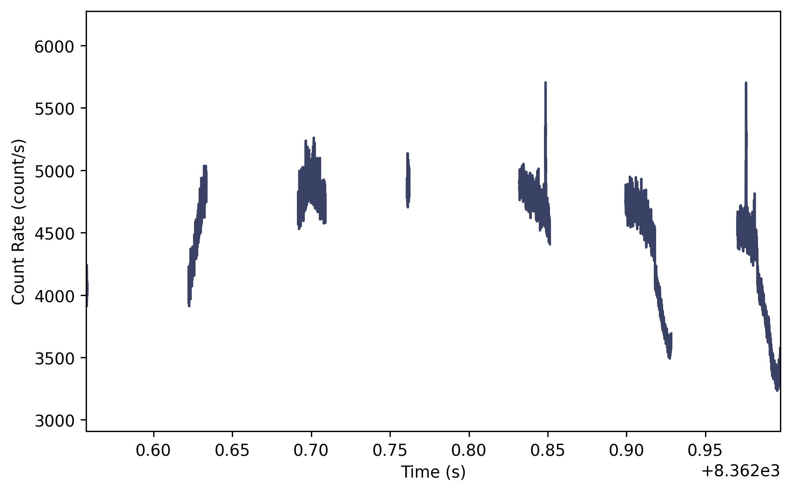
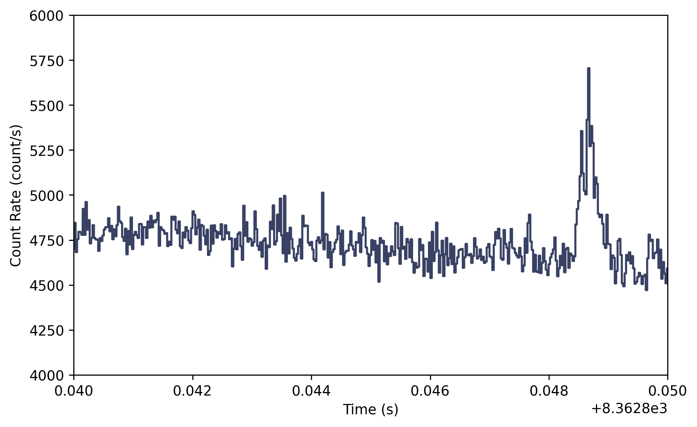
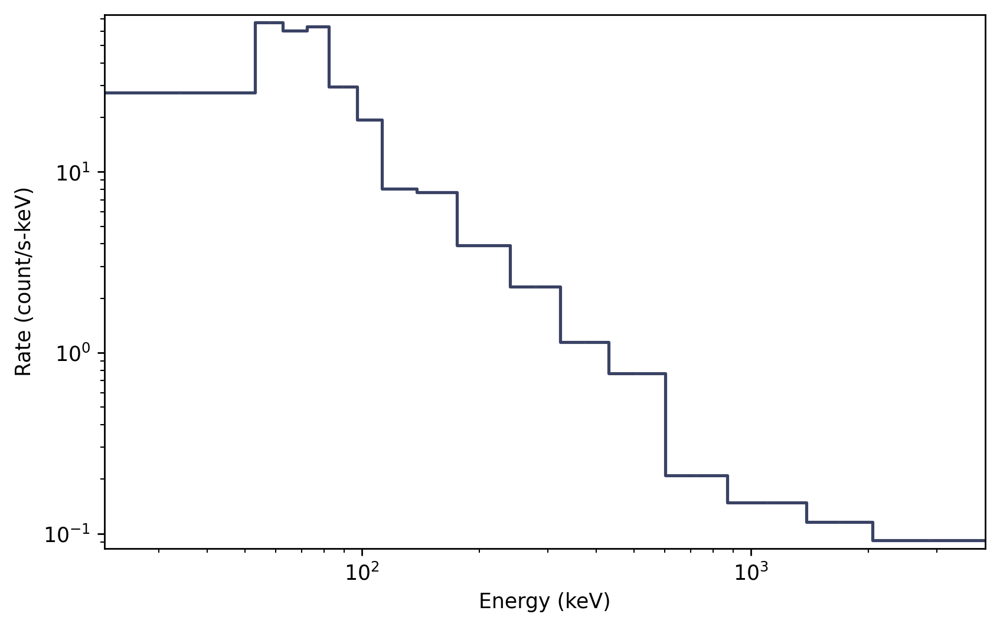
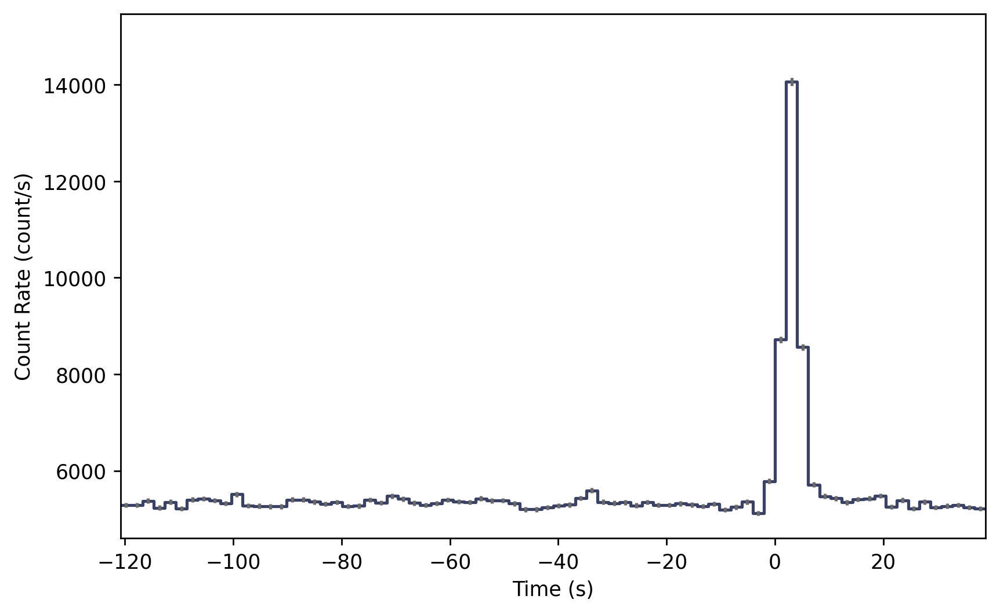

.. _batse-phaii:
.. |BatsePhaii| replace:: :class:`~gdt.missions.cgro.batse.phaii.BatsePhaii`
.. |BatsePhaiiCont| replace:: :class:`~gdt.missions.cgro.batse.phaii.BatsePhaiiCont`
.. |BatsePhaiiMulti| replace:: :class:`~gdt.missions.cgro.batse.phaii.BatsePhaiiMulti`
.. |BatsePhaiiTrigger| replace:: :class:`~gdt.missions.cgro.batse.phaii.BatsePhaiiTrigger`
.. |TimeEnergyBins| replace:: :class:`~gdt.core.data_primitives.TimeEnergyBins`
.. |TimeBins| replace:: :class:`~gdt.core.data_primitives.TimeBins`
.. |EnergyBins| replace:: :class:`~gdt.core.data_primitives.EnergyBins`
.. |Phaii| replace:: :class:`~gdt.core.phaii.Phaii`
.. |Lightcurve| replace:: :class:`~gdt.core.plot.lightcurve.Lightcurve`
.. |Spectrum| replace:: :class:`~gdt.core.plot.spectrum.Spectrum`

*******************************************************
BATSE PHAII Data (:mod:`gdt.missions.cgro.batse.phaii`)
*******************************************************
The primary science data produced by BATSE can be summarized as a time history of 
spectra, which is mostly provided  as temporally pre-binned data, and some small
amount of temporally unbinned (TTE) data around on-board triggers. These data 
types are produced as "snippets" for every single trigger and some are also 
provided continuously. There are generally two different types of files that 
contain BATSE PHAII data: files that contain PHAII data for a single detector
and files that contain PHAII data for multiple detectors. Both of these types
can be read with |BatsePhaii|.  

Reading Multi-Detector PHAII Files
==================================
Here is an example of reading a daily continuous file containing multiple 
detectors:

    >>> from gdt.core import data_path
    >>> from gdt.missions.cgro.batse.phaii import BatsePhaii
    >>> filepath = data_path / 'cgro-batse' / 'cont_08362.fits.gz'
    >>> phaii_multi = BatsePhaii.open(filepath)
    >>> phaii_multi
    <BatsePhaiiMulti: 8 detectors>
    
As you can see, reading this file returns a |BatsePhaiiMulti| object, which
contains the PHAII data for multiple detectors. In this example, the file 
contains data from all 8 LADs, but this isn't always the case.  We can 
retrieve a list of detector numbers that are in the file:

    >>> phaii_multi.detectors
    [0, 1, 2, 3, 4, 5, 6, 7]

If we want to retrieve a particular detector from the file, we can do that with
the following:

    >>> # retrieve the PHAII data for LAD 3
    >>> phaii3 = phaii_multi.get_detector(3)
    >>> phaii3
    <BatsePhaiiCont: 
     time range (8362.557340507052, 8362.997613099642);
     energy range (21.800001, 3999.9998)>

As you can see, a |BatsePhaiiCont| object is returned, which is simply a type
of |BatsePhaii| object.  Since these files are in the FITS format, the header
information is populated when retrieving a detector:

    >>> phaii3.headers.keys()
    ['PRIMARY', 'BATSE_E_CALIB', 'BATSE_CNTS']
    
    >>> phaii3.headers['PRIMARY']
    TELESCOP= 'COMPTON GRO'                                                         
    INSTRUME= 'BATSE   '                                                            
    ORIGIN  = 'MSFC    '           / Tape writing institution                       
    FILETYPE= 'BATSE_CONT'                                                          
    OBSERVER= 'G. J. Fishman'      / Principal investigator (256) 544-7691          
    TJD     =                 8362 / TJD at start of data                           
    STRT-DAY=             1991.106 / YYYY.DDD at start of data                      
    STRT-TIM=                  1.0 / seconds of day at start of data                
    END-DAY =             1991.106 / YYYY.DDD at end of data                        
    END-TIM =              86398.0 / seconds of day at end of data                  
    N_E_CHAN=                   16 / number of energy channels                      
    TIME_RES=                2.048 / Time resolution of data (second)               
    EQUINOX =               2000.0 / J2000 coordinates                              
    SC-Z-RA =              108.149 / Z axis RA in degrees                           
    SC-Z-DEC=               -6.583 / Z axis Dec in degrees                          
    SC-X-RA =                19.08 / X axis RA in degrees                           
    SC-X-DEC=                8.022 / X axis Dec in degrees                          
    SC-Z-LII=             -138.797 / Z axis Galactic coordinate LII in degr         
    SC-Z-BII=                1.675 / Z axis Galactic coordinate BII in degr         
    SC-X-LII=              133.537 / X axis Galactic coordinate LII in degr         
    SC-X-BII=              -54.337 / X axis Galactic coordinate BII in degr         
    QMASKDAT= 'CONFITS1'           / mask used for data filtering                   
    QMASKHKG= 'OHEDIT2 '           / mask used for housekeeping data filtering      
    FILE-ID = 'CONT_08362.FITS'    / Name of FITS file                              
    FILE-VER= 'V1.00   '           / Version of FITS file format                    
    FILENAME= '[.DDS08362]CONTINUOUS_DATA.DAT DDS08362' / Original File             
    CDATE   = '2-JUL-2002 15:41:30.59' / Date FITS file created                     
    MNEMONIC= 'CONT_DISCLA_FITS 4.10' / Program creating this file                  
    PRIMTYPE= 'NONE    '           / No primary array                              

There is easy access for certain important properties of the data:

    >>> # the good time intervals for the data
    >>> phaii3.gti
    <Gti: 1 intervals; range (8362.557340507052, 8362.997613099642)>
        
    >>> # the time range
    >>> phaii3.time_range
    (8362.557340507052, 8362.997613099642)
    
    >>> # the energy range
    >>> phaii3.energy_range
    (21.800001, 3999.9998)
    
    >>> # number of energy channels
    >>> phaii3.num_chans
    16

.. note::
  The time values are based on the CGRO mission epoch and format, which
  is Truncated Julian Date and details can be found here `cgro-time`_.

Working with BATSE PHAII objects
================================

We can retrieve the time history spectra data contained within the file, which
is a |TimeEnergyBins| class (see 
:external:ref:`2D Binned Data<core-data_primitives-2d>` for more details).

    >>> phaii3.data
    <BatseTimeEnergyBins: 4485 time bins;
     time range (8362.557340507052, 8362.997613099642);
     7 time segments;
     16 energy bins;
     energy range (21.800001, 3999.9998);
     1 energy segments>

Through the |Phaii| base class, there are a lot of high level functions 
available to us, such as slicing the data in time or energy:

    >>> time_sliced_phaii3 = phaii3.slice_time((8362.6, 8362.7))
    >>> time_sliced_phaii3
    <BatsePhaiiCont: 
     time range (8362.557814581125, 8362.700013099642);
     energy range (21.800001, 3999.9998)>

    >>> energy_sliced_phaii3 = phaii3.slice_energy((50.0, 500.0))
    >>> energy_sliced_phaii3
    <BatsePhaiiCont: 
     time range (8362.557340507052, 8362.997613099642);
     energy range (21.800001, 601.1419)>

As mentioned, this data is 2-dimensional, so what do we do if we want a 
lightcurve covering a particular energy range? We integrate (sum) over energy, 
and we can easily do this:

    >>> lightcurve = phaii3.to_lightcurve(energy_range=(50.0, 500.0))
    >>> lightcurve
    <BatseTimeBins: 4485 bins;
     range (8362.557340507052, 8362.997613099642);
     7 contiguous segments>

Similarly, we can integrate over time to produce a count spectrum:
    
    >>> spectrum = phaii3.to_spectrum(time_range=(8362.6, 8362.7))
    >>> spectrum
    <EnergyBins: 16 bins;
     range (21.800001, 3999.9998);
     1 contiguous segments>

The resulting objects are |TimeBins| and |EnergyBins|, respectively, and see
:external:ref:`1D Binned Data<core-data_primitives-1d>` for more details on how 
to use them.

Of course, once we have produced a lightcurve or spectrum data object, often
we want to plot it.  For that, we use the |Lightcurve| and |Spectrum| plotting
classes:
    
    >>> import matplotlib.pyplot as plt
    >>> from gdt.core.plot.lightcurve import Lightcurve
    >>> lcplot = Lightcurve(data=lightcurve)
    >>> lcplot.errorbars.hide()
    >>> plt.show()

This plot shows the lightcurve over a full day of observations.  The dropouts in
the lightcurve is when the detector is turned off, most likely as CGRO was 
passing through the South Atlantic Anomaly.

We can zoom in to a particular region of the plot and uncover a GRB-like signal:

    >>> lcplot.xlim = (8362.84, 8362.85)
    >>> lcplot.ylim = (4000, 6000)
    

Similarly, we can plot the count spectrum:

    >>> from gdt.core.plot.spectrum import Spectrum
    >>> specplot = Spectrum(data=spectrum)
    >>> plt.show()

See :external:ref:`Plotting Lightcurves<plot-lightcurve>` and 
:external:ref:`Plotting Count Spectra<plot-spectrum>` for more on
how to modify these plots.

Reading BATSE trigger PHAII files
=================================
Similarly, we can read triggered BATSE PHAII, which mostly keep to a single 
detector per file.  For example:

    >>> filepath = data_path / 'cgro-batse' / 'cont_bfits_3_105.fits.gz'
    >>> phaii_trig = BatsePhaii.open(filepath)
    >>> phaii_trig
    <BatsePhaiiTrigger: cont_bfits_3_105.fits.gz;
     trigger time: 8367.384765694444;
     time range (-120.83200073242188, 38.9119987487793);
     energy range (13.140961, 100000.0)>

Notice that the object is a |BatsePhaiiTrigger|, which is a special type of 
|BatsePhaii| object. All of the same attributes and functions we looked at for
the multi-detector files apply here.  For example, we can plot the full-band
lightcurve:

    >>> lc = phaii_trig.to_lightcurve()
    >>> lcplot = Lightcurve(data=lc)
    >>> plt.show()

Notice that the times here are relative to the trigger time:

    >>> phaii_trig.trigtime
    8367.384765694444

There are many different types of BATSE data that can be accessed and analyzed
using the GDT. For a listing of these data types and visual examples, see the
:ref:`BATSE Data File Gallery<batse-gallery>`.

For more details about working with PHAII data, see 
:external:ref:`PHAII Files<core-phaii>`.
 
Reference/API
=============

.. automodapi:: gdt.missions.cgro.batse.phaii
   :inherited-members:

