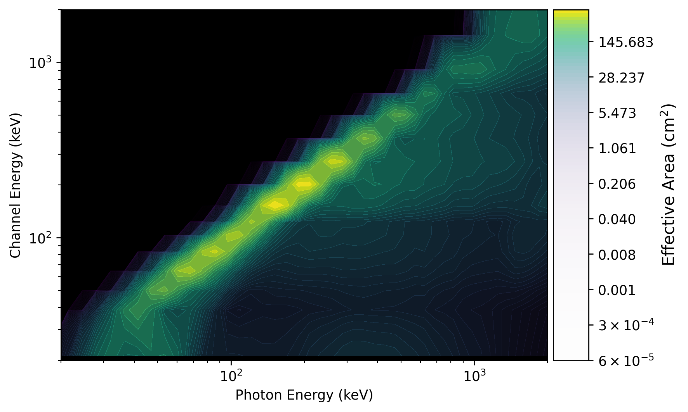
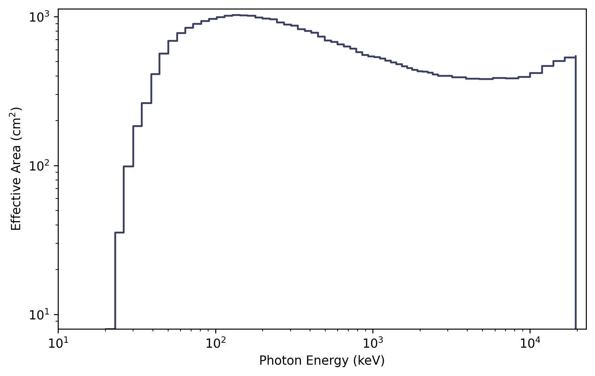

.. _batse-response:
.. |BatseRsp| replace:: :class:`~gdt.missions.cgro.batse.response.BatseRsp`
.. |BatseRspMulti| replace:: :class:`~gdt.missions.cgro.batse.response.BatseRspMulti`
.. |ResponseMatrix| replace:: :class:`~gdt.core.data_primitives.ResponseMatrix`
.. |PowerLaw| replace:: :class:`~gdt.spectra.functions.PowerLaw`
.. |EnergyBins| replace:: :class:`~gdt.core.data_primitives.EnergyBins`
.. |ResponsePlot| replace:: :class:`~gdt.plot.drm.ResponsePlot`
.. |PhotonEffectiveArea| replace:: :class:`~gdt.plot.drm.PhotonEffectiveArea`
.. |ChannelEffectiveArea| replace:: :class:`~gdt.plot.drm.ChannelEffectiveArea`

*********************************************************************
BATSE Detector Responses (:mod:`gdt.missions.cgro.batse.response`)
*********************************************************************
The BATSE detector response files allow you to compare a theoretical photon 
spectrum to an observed count spectrum. In short, a single detector response 
file is only useful for its corresponding detector, for a given source position 
on the sky, and a given time (or relatively short time span). Essentially, one 
file contains one or more detector response matrices (DRMs) encoding the energy 
dispersion and calibration of incoming photons at different energies to recorded 
energy channels. The matrix also encodes the effective area of the detector as a 
function of energy for a given source position relative to the detector pointing. 
This effective area can change dramatically as there is a strong 
angular-dependence of the response (and the angular-dependence changes with 
energy!). A file that contains a DRM for a single detector is represented by 
the |BatseRsp| class and a file that contains DRMs for multiple detectors is 
represented by the |BatseRspMulti| class.

Single-Detector Response Files
==============================
Similar to the science data, we can open/read a response file in the following 
way:

    >>> from gdt.core import data_path
    >>> from gdt.missions.cgro.batse.response import BatseRsp
    >>> filepath = data_path / 'cgro-batse' / 'cont_drm_3_105.fits.gz'
    >>> rsp = BatseRsp.open(filepath)
    >>> rsp
    <BatseRsp: cont_drm_3_105.fits.gz;
     trigger time: 8367.384765717592;
     time range (-0.0013985185178171378, 0.0004503472227952443);
     62 energy bins; 16 channels>

Notice that this returns a single-DRM response object.  We can access the DRM
directly, which is a |ResponseMatrix| object:

    >>> rsp.drm
    <ResponseMatrix: 62 energy bins; 16 channels>

We can fold a photon model through the response matrix to get out a count 
spectrum.  For example, we fold a |PowerLaw| photon model:

    >>> from gdt.core.spectra.functions import PowerLaw
    >>> pl = PowerLaw()
    >>> # power law with amplitude=0.01, index=-2.0
    >>> rsp.fold_spectrum(pl.fit_eval, (0.01, -2.0))
    <EnergyBins: 16 bins;
     range (13.140960693359375, 100000.0);
     1 contiguous segments>

This returns an |EnergyBins| object containing the count spectrum.  See 
:external:ref:`Instrument Responses<core-response>` for more information on 
working with single-DRM responses.

What does a DRM actually look like? We can make a plot of one using the 
|ResponsePlot|:

    >>> import matplotlib.pyplot as plt
    >>> from gdt.core.plot.drm import ResponsePlot
    >>> drmplot = ResponsePlot(rsp.drm)
    >>> drmplot.xlim = (20.0, 2000.0)
    >>> drmplot.ylim = (20.0, 2000.0)
    >>> plt.show()

What we see in the plot is a diagonal edge that contains a majority of the 
effective area. This approximately linear mapping of photon energy to energy 
channel is called the photopeak. There is also see a bunch of off-diagonal 
contribution from photons deposited into energy channels lower than the 
original photon energy. This presence of non-negligible off-diagonal response 
is one of the reasons that the DRM is not invertible (our lives would be so 
much easier if was, though). 

We can also make a plot of the effective area integrated over photon energies 
using |PhotonEffectiveArea|:

    >>> from gdt.core.plot.drm import PhotonEffectiveArea
    >>> effarea_plot = PhotonEffectiveArea(rsp.drm)
    >>> plt.show()

For more details about customizing these plots, see 
:external:ref:`Plotting DRMs and Effective Area<plot-drm>`.

Multi-Detector Response Files
==============================
Some of the response files contain multiple detectors.  These are typically
identifiable because they do not have a detector number in their filename.
You can read these with |BatseRspMulti|:

    >>> from gdt.missions.cgro.batse.response import BatseRspMulti
    >>> filepath = data_path / 'cgro-batse' / 'discsc_drm_105.fits.gz'
    >>> rsp_multi = BatseRspMulti.open(filepath)
    >>> rsp_multi
    <BatseRspMulti: 2 detectors>
    
Note that this contains DRMs for two detectors.  We can see which detectors'
DRMs are stored in this file:

    >>> rsp_multi.detectors
    ['LAD3', 'LAD7']

And we can extract one of the DRMs by detector number, name or detector object.
For example:

    >>> rsp3 = rsp_multi.get_detector('LAD3')
    >>> rsp3
    <BatseRsp: discsc_drm_3_105.fits.gz;
     trigger time: 8367.384765717592;
     time range (-0.0013985185178171378, 0.0004503472227952443);
     30 energy bins; 4 channels>

This returns a single-detector DRM, and we can perform all the same actions
as we did in the previous example.

Reference/API
=============

.. automodapi:: gdt.missions.cgro.batse.response
   :inherited-members:

