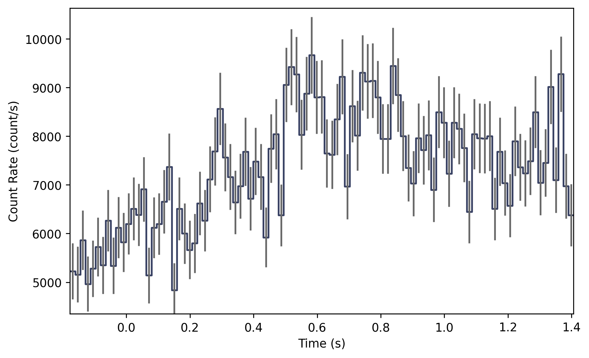
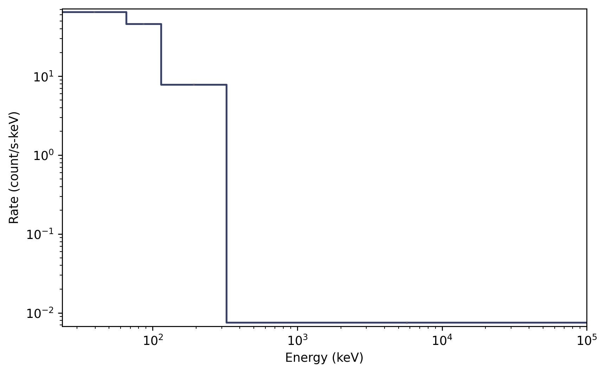

.. _batse-tte:
.. |BatseTte| replace:: :class:`~gdt.missions.cgro.batse.tte.BatseTte`
.. |EventList| replace:: :class:`~gdt.core.data_primitives.EventList`
.. |PhotonList| replace:: :class:`~gdt.core.tte.PhotonList`
.. |bin_by_time| replace:: :class:`~gdt.binning.unbinned.bin_by_time`
.. |combine_by_factor| replace:: :class:`~gdt.binning.binned.combine_by_factor`
.. |BatsePhaii| replace:: :class:`~gdt.missions.cgro.batse.phaii.BatsePhaii`
.. |Lightcurve| replace:: :class:`~gdt.plot.lightcurve.Lightcurve`
.. |Spectrum| replace:: :class:`~gdt.plot.spectrum.Spectrum`

***************************************************
BATSE TTE Data (:mod:`gdt.missions.cgro.batse.tte`)
***************************************************
The BATSE TTE (Time-Tagged Event) data is basically a time-series of "counts" 
where each count is mapped to an energy channel. TTE for all detectors is 
typically stored in a single file, similar to BATSE multi-detector PHAII files
(see :ref:`BATSE PHAII Data<batse-phaii>`).  We can read the TTE files in the 
same way we read PHAII files

    >>> from gdt.core import data_path
    >>> from gdt.missions.cgro.batse.tte import BatseTte
    >>> filepath = data_path / 'cgro-batse' / 'tte_list_105.fits.gz'
    >>> tte_multi = BatseTte.open(filepath)
    >>> tte_multi
    <BatseTteMulti: 8 detectors>

We can extract TTE data for a single detector in this way:

    >>> tte3 = tte_multi.get_detector(3)
    >>> tte3
    <BatseTteTrigger: tte_list_3_105.fits.gz;
     trigger time: 8367.384765694444;
     time range (-0.17728911, 1.402839);
     energy range (23.739225387573242, 100000.0)>

Notice that the time range is very short, which is a limitation of BATSE TTE.
Since this data is in the FITS format, the data files have multiple data extensions, 
each with metadata information in a header. There is also a primary header that 
contains metadata relevant to the overall file. You can access this metadata 
information:

    >>> tte3.headers.keys()
    ['PRIMARY', 'BATSE_E_CALIB', 'BATSE PHOTON LIST']
    
There is easy access for certain important properties of the data:

    >>> # the good time intervals for the data
    >>> tte3.gti
    <Gti: 1 intervals; range (-0.17728911340236664, 1.402838945388794)>
    
    >>> # the trigger time
    >>> tte3.trigtime
    8367.384765694444
    
    >>> # the time range
    >>> tte3.time_range
    (-0.17728911, 1.402839)
    
    >>> # the energy range
    >>> tte3.energy_range
    (23.739225387573242, 100000.0)
    
    >>> # number of energy channels
    >>> tte3.num_chans
    4

We can retrieve the time-tagged events data contained within the file, which
is an |EventList| class (see 
:external:ref:`Event Data<core-data_primitives-event>` for more details).

    >>> tte3.data
    <EventList: 11347 events;
     time range (-0.17728911, 1.402839);
     channel range (0, 3)>

Through the |PhotonList| base class, there are a lot of high level functions 
available to us, such as slicing the data in time or energy:

    >>> time_sliced_tte3 = tte3.slice_time((0.0, 1.0))
    >>> time_sliced_tte3
    <BatseTteTrigger: 
     trigger time: 8367.384765694444;
     time range (0.0004968763096258044, 0.9998628497123718);
     energy range (23.739225387573242, 100000.0)>

    >>> energy_sliced_tte3 = tte3.slice_energy((50.0, 300.0))
    >>> energy_sliced_tte3
    <BatseTteTrigger: 
     trigger time: 8367.384765694444;
     time range (-0.17728911340236664, 1.4028009176254272);
     energy range (23.739225387573242, 323.4146423339844)>

Making a lightcurve using TTE data is slightly more complicated than it is for 
the pre-binned data because the TTE is temporally unbinned. So first the data 
has to be binned, and then it can be displayed. Here, we want to bin unbinned 
data, so we choose from the 
:external:ref:`Binning Algorithms for Unbinned Data<binning_unbinned>`. For
this example, let's choose |bin_by_time|, which simply bins the TTE to the
prescribed time resolution.  Then we can use our chosen binning algorithm to
**convert** the TTE to a PHAII object

    >>> from gdt.core.binning.unbinned import bin_by_time
    >>> phaii3 = tte3.to_phaii(bin_by_time, 0.016)
    >>> phaii3
    <BatsePhaiiTrigger: 
     trigger time: 8367.384765694444;
     time range (-0.17728911340236664, 1.4067108865976348);
     energy range (23.739225387573242, 100000.0)>

Here, we binned the data to 16 ms resolution.  Now that it is 
a |BatsePhaiiTrigger| object, we can do all of the same operations that we could 
with BATSE PHAII data.  For example, we can plot the lightcurve using the 
|Lightcurve| class:

    >>> import matplotlib.pyplot as plt
    >>> from gdt.core.plot.lightcurve import Lightcurve
    >>> lcplot = Lightcurve(data=phaii3.to_lightcurve())
    >>> plt.show()
    

One thing to note, if we want to temporally rebin the data, we could certainly 
rebin the PHAII object, but in order to leverage the full power and flexibility 
of TTE, it would be good to (re)bin the TTE data instead to create a new PHAII
object.

To plot the spectrum, we don't have to worry about binning the data, since the 
TTE is already necessarily pre-binned in energy. So we can make a spectrum plot 
directly from the TTE object without any extra steps using the |Spectrum| 
class:

    >>> from gdt.core.plot.spectrum import Spectrum
    >>> # integrate over time from 0 - 1 s
    >>> spectrum = tte3.to_spectrum(time_range=(0.0, 1.0))
    >>> specplot = Spectrum(data=spectrum)
    >>> plt.show() 

See :external:ref:`Plotting Lightcurves<plot-lightcurve>` and 
:external:ref:`Plotting Count Spectra<plot-spectrum>` for more on how to modify 
these plots.
    
For more details about working with TTE data, see 
:external:ref:`Photon List and Time-Tagged Event Files<core-tte>`.

    
Reference/API
=============

.. automodapi:: gdt.missions.cgro.batse.tte
   :inherited-members:

